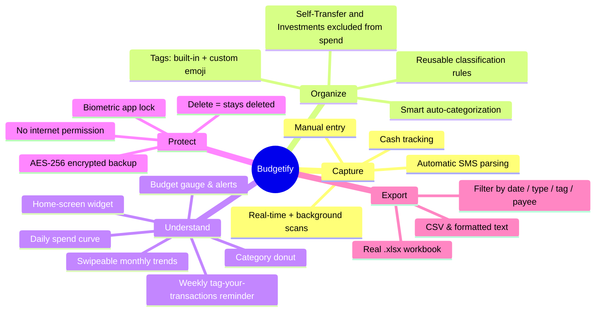
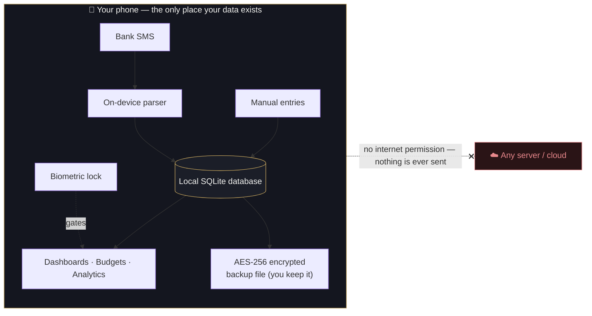
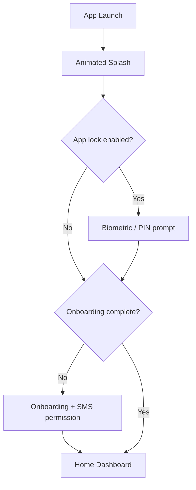
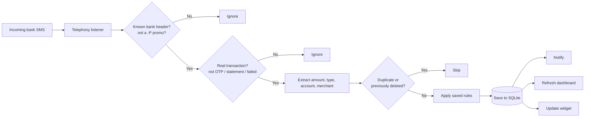
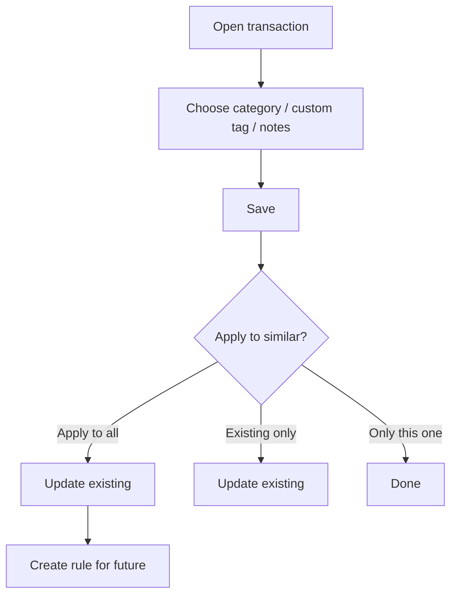
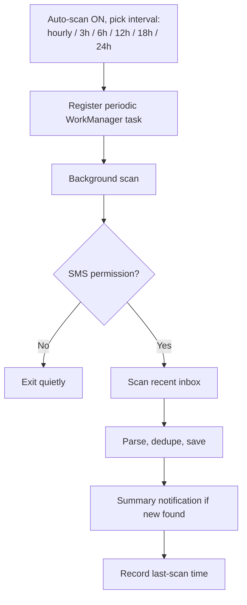
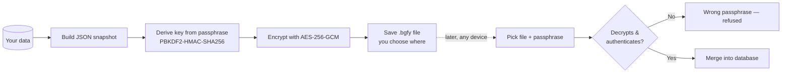
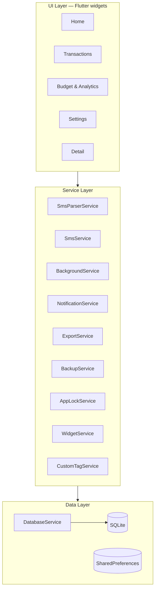

<div align="center">


<br/>

**The private, offline budget tracker that does the work for you.**
Budgetify reads your bank SMS on-device, turns them into a clean spending picture, and never sends a byte off your phone.

<br/>


</div>

---

## Why Budgetify exists

Most people in India already get a text message for **every** bank transaction — UPI, card, ATM, NEFT, the lot. The information needed to understand your spending is *already on your phone*. Yet the popular budgeting apps:

- 📤 **upload your financial life to the cloud** to "sync" it,
- 🧾 **ask you to log every expense by hand** (which nobody keeps up),
- 📺 **bury the experience in ads, upsells, and account creation**, and
- 🔌 **stop working without internet.**

**Budgetify takes the opposite approach.** It reads the transaction SMS your bank already sends, parses them entirely on your device, and builds your budget automatically — **no sign-up, no servers, no internet permission, no ads.** Your money data simply never leaves your phone.

> 💡 **The pitch in one line:** *Automatic, accurate budgeting from the SMS you already receive — fully offline, genuinely private, and beautiful to use.*

---

## What makes it different

| | Budgetify | Typical budgeting app |
|---|---|---|
| **Where your data lives** | 🔒 Only on your device (SQLite) | ☁️ Uploaded to a cloud account |
| **Internet** | 🚫 Not even requested | ✅ Required |
| **Data entry** | 🤖 Automatic from bank SMS | ✍️ Mostly manual |
| **Account / sign-up** | ❌ None | 📧 Email/phone required |
| **Ads & upsells** | ❌ None | 📺 Common |
| **Backups** | 🔐 You own the file (AES-256 encrypted) | Locked in their cloud |
| **Works on a plane** | ✈️ Yes | ❌ No |

---

## ✨ Highlights

- 🤖 **Zero-effort tracking** — incoming bank SMS become categorized transactions automatically, in real time and via scheduled background scans.
- 🛡️ **Privacy by architecture** — the app has **no internet permission**. It is technically incapable of uploading your data.
- 🎯 **Accurate by design** — strict, regulation-aware sender matching ignores OTPs, promos, and that ₹30,000 "scholarship" SMS from your college.
- 💎 **A genuinely premium feel** — a hand-built "midnight ink & champagne gold" theme, the Manrope typeface, glassmorphic surfaces, an animated splash, and tasteful motion throughout.
- 📊 **Real analytics** — budget gauges, a decongested category donut, daily spend curves, and swipeable month-by-month history.
- 🔐 **Your data, your keys** — biometric app lock and passphrase-encrypted backups you can store anywhere.
- 📱 **A home-screen widget** for an at-a-glance read without opening the app.

---

## 📸 Screenshots

> _Drop your device screenshots into `docs/screenshots/` and they'll appear here._

| Home Dashboard | Budget & Analytics | Transaction Detail | Settings |
|:---:|:---:|:---:|:---:|
| _coming soon_ | _coming soon_ | _coming soon_ | _coming soon_ |

<!--
To add screenshots, save PNGs as docs/screenshots/home.png etc. and replace the row above with:
|  |  |  |  |
-->

---

## 🧭 Feature tour



### 🤖 Automatic transaction capture
Budgetify listens for bank SMS and reads your existing inbox so your history is populated from day one. Every credit and debit is detected, de-duplicated, and saved — **without you typing anything.**
**Benefit:** the #1 reason budgets fail is manual logging. Budgetify removes it entirely.

### 🎯 Reliable, regulation-aware parsing
Indian banks send from dozens of sender IDs (`VM-SBIUPI-S`, `JD-MAHABK`, `BV-HDFCBK-T`…). Budgetify:
- matches against a curated list of **~1,900 bank headers** (including SBI Card and cooperative banks),
- understands TRAI's `-S`/`-T`/`-P` routing suffixes and **silently drops promotional (`-P`) messages**,
- ignores OTPs, statements, failed payments, and autopay reminders,
- parses tricky formats like SBI's bare `"debited by 35.0"` and never mistakes your **available balance** for the transaction amount.

**Benefit:** your spending totals are trustworthy — no phantom transactions from spam or scholarship texts.

### 🏷️ Effortless organization
Transactions auto-map to categories from merchant keywords (Swiggy → Food, Uber → Transport…). You can re-tag in a tap, create **custom tags with your own emoji**, and save **rules** so similar transactions classify themselves forever. Tag a transfer between your own accounts as **Self Transfer** or money moved into **Investments**, and Budgetify correctly keeps it **out of your spending totals** — because relocating your own money isn't an expense.

### 📊 Analytics that actually inform
- **Budget gauge** with a gold progress ring and threshold alerts at 50/75/90/100%+.
- **Category donut** that groups tiny slices into "Other" so it never looks cluttered.
- **Daily spending curve** with a budget-pace line for the current month.
- **Swipeable monthly history** — every past month gets the full picture, not just the current one.

### 🔎 Find anything, fast
Search by **payee, amount, or date**, and stack **independent filters** — type (credit/debit) and status (classified/unclassified) combine freely, so "unclassified debits" or "classified credits" are one tap each. A **weekly reminder** nudges you about the month's still-untagged transactions and opens straight to them.

### 🔐 Privacy & security you can verify
- **No `INTERNET` permission** in the manifest — uploading is impossible by construction.
- **Biometric app lock** (fingerprint / face / device PIN) that gates the whole app.
- **AES-256-GCM encrypted backups** with a PBKDF2 passphrase — restore on any device, store the file wherever you trust.
- **Deletes are permanent** — a removed transaction is tombstoned so background scans never resurrect it.

### 📤 Exports you own
One tap produces a genuine **Excel `.xlsx`** workbook (with a summary sheet), a clean **CSV**, or a formatted **text report** — optionally **filtered** by date range, type, category/tag, or payee.

### 📱 Home-screen widget
Month-to-date spend, budget progress, income, net, and your top spending category — at a glance, without opening the app.

---

## 🔒 The privacy model, visualized

Everything happens inside the phone. There is no server in this diagram because there is no server.



---

## 🛠️ How it works

### App launch → splash → (optional) lock → home



### Real-time SMS → transaction pipeline



### Classification & reusable rules



### Background scheduled scans



### Encrypted backup & restore



---

## 🏗️ Architecture & tech stack



| Concern | Choice |
|---|---|
| Framework | **Flutter** (Dart 3) |
| SMS access | `another_telephony` (maintained fork) |
| Local database | `sqflite` (SQLite) |
| Charts | `fl_chart` |
| Background work | `workmanager` |
| Notifications | `flutter_local_notifications` |
| Biometric lock | `local_auth` |
| Backup encryption | `cryptography` (AES-GCM + PBKDF2) |
| Excel export | `excel` |
| Home widget | `home_widget` |
| State | `provider` |
| Typeface | **Manrope** (bundled) |

---

## 🔑 Permissions — and why each is needed

Budgetify asks for the **minimum** to do its job. Notably, **`INTERNET` is not in the list.**

| Permission | When | Why |
|---|---|---|
| `RECEIVE_SMS` | Install time | Detect incoming bank SMS in real time |
| `READ_SMS` | Onboarding / permission card | Read existing SMS for the first historical scan and background scans |
| `POST_NOTIFICATIONS` | Android 13+ | Transaction and budget-threshold alerts |
| `USE_BIOMETRIC` | When you enable App Lock | Fingerprint / face unlock |
| `READ/WRITE/MANAGE storage` | When you export or back up | Save the export/backup file where you choose |

> 🛡️ **What's *not* requested:** internet/network access. The app cannot phone home.

---

## 💾 Data & storage

- **SQLite** — transactions, budgets, classification rules, and deletion tombstones.
- **SharedPreferences** — settings (theme, auto-scan interval, last scan, app-lock flag, custom tags & emoji).
- **Backup files** — AES-256-GCM encrypted `.bgfy` snapshots that **you** store and control.
- **No server-side storage of any kind.**

---

## 🚀 Getting started (development)

A standard Flutter project.

```bash
# 1. Install dependencies
flutter pub get

# 2. Static analysis (should be clean)
flutter analyze

# 3. Run the test suite (parser, export, backup crypto, non-expense logic)
flutter test

# 4. Run on a connected Android device
flutter run

# 5. Build a release APK
flutter build apk --release
```

**Requirements:** Flutter SDK (Dart ≥ 3.9), Android SDK, and a physical Android device or emulator. SMS features require a **real device with SMS access** — emulators won't receive bank texts.

---

## 📱 Platform support

| Platform | Status |
|---|---|
| **Android** | ✅ Full functionality — SMS parsing, background scans, notifications, widget, biometric lock |
| **iOS** | ⚠️ iOS does not allow apps to read SMS, so SMS-driven features are unavailable by platform policy |

---

## ❓ FAQ

**Does Budgetify send my messages or transactions anywhere?**
No. There is no internet permission; all parsing and storage happen on-device.

**Will it read my personal (non-bank) messages?**
Only messages from recognized bank senders are processed; everything else is ignored at the source.

**What if a transaction is wrong or spammy?**
Delete it — it's tombstoned so future scans won't bring it back. You can also fine-tune categories and rules.

**How do I move my data to a new phone?**
Create an encrypted backup, copy the `.bgfy` file across, and restore it with your passphrase.

**Is my history safe if I lose my phone?**
Enable the biometric App Lock, and keep an encrypted backup somewhere safe.

---

## 🗺️ Roadmap ideas

- Per-account balance tracking from SMS balances
- Subscription / recurring-payment detection
- An "unparsed bank SMS" review screen to teach the parser new formats
- Richer widget sizes

---

<div align="center">

**Budgetify** — automatic, private, offline budgeting that respects you.

<sub>Built with Flutter. Your data stays yours.</sub>

</div>
