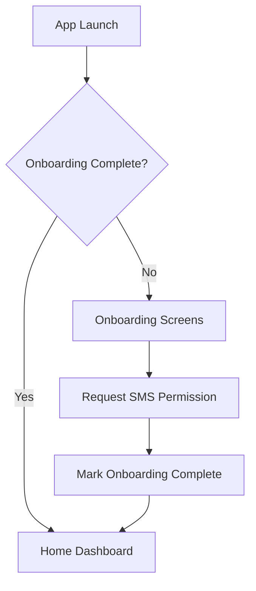
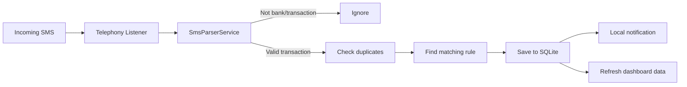
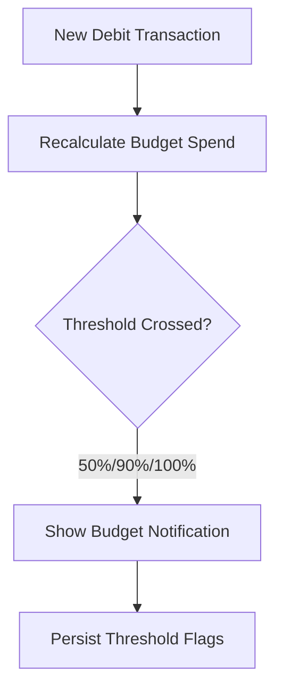

# Budget Tracker

SMS-based budget analysis app that detects bank transactions from incoming SMS messages, stores them locally, and provides dashboards, budgets, and analytics. All processing happens on-device.

## Platform Support

- **Android:** Full functionality including SMS parsing, background scans, and notifications.
- **iOS:** SMS access is not available on iOS, so SMS-driven features are not supported.

## Feature Overview

- **Onboarding & permission guidance** with a privacy disclaimer and SMS permission flow.
- **Automatic SMS detection** for credits and debits from bank senders.
- **Manual transaction entry** with categories, notes, and dates.
- **Transaction list & filters** (type, category, unclassified only).
- **Transaction classification** with bulk actions and reusable rules.
- **Budget & analytics** with progress, daily charts, category spend, and monthly trends.
- **Expense trend chart** (last 7 days) on the home dashboard.
- **Cash tracking** for cash spend and cash conversion entries.
- **Notifications** for detected transactions and budget thresholds.
- **Theme toggle** (light/dark) and **auto-scan scheduling**.

## Permissions (User-App Level)

| Permission | Platform | When Requested | Why It’s Needed |
| --- | --- | --- | --- |
| `android.permission.READ_SMS` | Android | Onboarding or permission card | Read existing SMS for historical scans and background scans. |
| `android.permission.RECEIVE_SMS` | Android | Manifest (install time) | Listen for incoming bank SMS to detect transactions in real time. |
| `android.permission.POST_NOTIFICATIONS` | Android 13+ | Alongside SMS permission | Show transaction and budget alerts. |

> Note: The app does **not** request internet access and does **not** upload SMS data. All data is stored locally.

## Data Storage & Privacy

- **SQLite (sqflite)** stores transactions, budgets, and classification rules locally.
- **SharedPreferences** stores settings (auto-scan enabled, scan times, last scan).
- **No server-side storage**; SMS content stays on-device.

## How the App Works

### 1) Launch & Onboarding

- App initializes notification and background services.
- If onboarding is incomplete, the user is guided to grant SMS permission.
- If permission is denied, the app still opens but shows a permission request card.



### 2) Real-Time SMS Transaction Detection

- Telephony listener receives SMS.
- Parser validates bank sender and extracts amount, type, and account info.
- Dedupe check prevents duplicates.
- Optional auto-classification with saved rules.
- Transaction stored in SQLite and notifications are sent.



### 3) Transaction Classification & Rules

- Users classify a transaction in the detail screen.
- Bulk options allow applying classification to similar transactions.
- Rules can be saved for future auto-classification.

```mermaid
flowchart TD
  Open[Open Transaction Detail] --> Select[Choose Category & Notes]
  Select --> Save[Save Classification]
  Save --> Bulk{Apply to Similar?}
  Bulk -- Apply to All --> UpdateAll[Bulk Update Existing]
  UpdateAll --> RuleFuture[Create Rule (Apply to Future)]
  Bulk -- Existing Only --> UpdateExisting[Bulk Update Existing]
  UpdateExisting --> RuleNoFuture[Create Rule (No Future Apply)]
  Bulk -- Only This One --> Done[Finish]
```

### 4) Budget Monitoring & Alerts

- A budget can be set and edited from the Budget & Analytics screen.
- Spending is tracked for the current period.
- Notifications are sent when 50%, 90%, or 100% thresholds are crossed.



### 5) Background Scheduled Scans

- Users can enable auto-scan from Settings and choose scan times.
- WorkManager runs periodic background scans to pick up missed SMS.

```mermaid
flowchart TD
  Settings[Enable Auto-Scan] --> Register[Register Periodic WorkManager Task]
  Register --> Task[Background Scan Task]
  Task --> Perm{SMS Permission?}
  Perm -- No --> Stop[Exit]
  Perm -- Yes --> Scan[Scan Existing SMS (Last 50)]
  Scan --> Parse[Parse & Save Transactions]
  Parse --> Record[Record Last Scan Time]
```

## Screens & What They Do

- **Home Dashboard**
  - Monthly spend summary, income vs. expense, and net balance.
  - Quick actions (Transactions, Unclassified, Scan SMS).
  - Expense trend chart (last 7 days).
  - Budget card and cash summary.
- **Transactions**
  - Filter by type/category/unclassified, delete entries, and add manual entries.
- **Transaction Detail**
  - Review SMS, add notes, and classify with bulk rule creation.
- **Budget & Analytics**
  - Budget progress, daily spending chart, category breakdown, and monthly trends.
- **Settings**
  - Theme toggle, auto-scan schedule, and last scan time.

## Notes on SMS Parsing

- Bank sender IDs are matched against known patterns and generic bank formats.
- Merchant keywords auto-map to categories (Food, Shopping, Travel, etc.).
- Credits vs debits are inferred from SMS content and amount patterns.

## Getting Started (Development)

This is a Flutter project. Standard Flutter commands apply:

- `flutter pub get`
- `flutter analyze`
- `flutter test`
