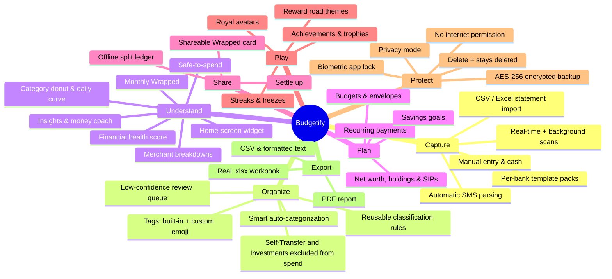
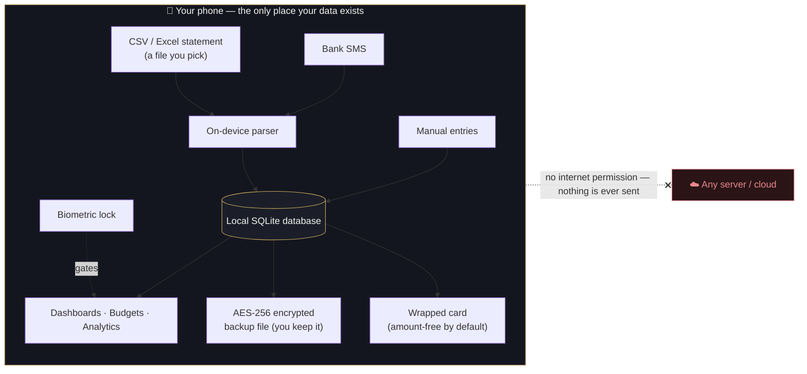
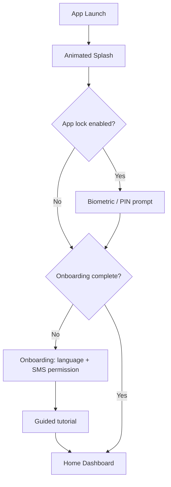
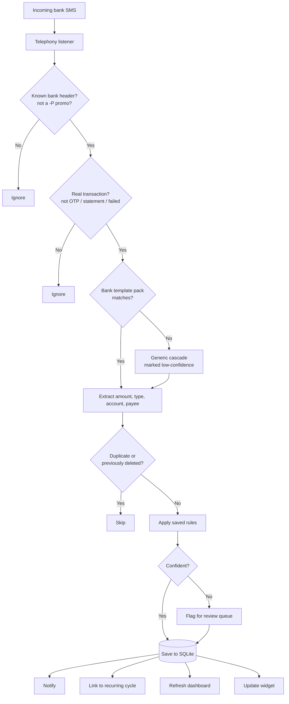
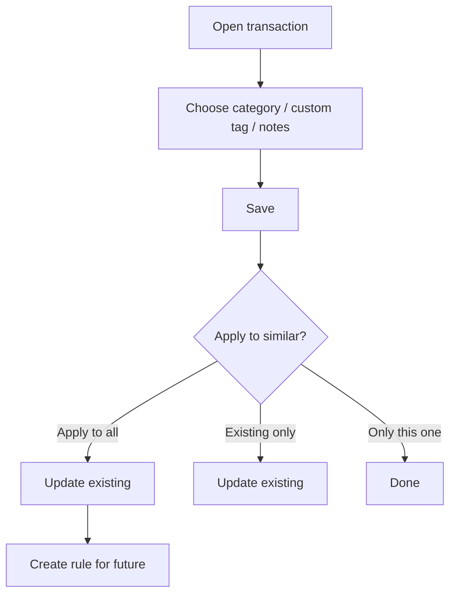
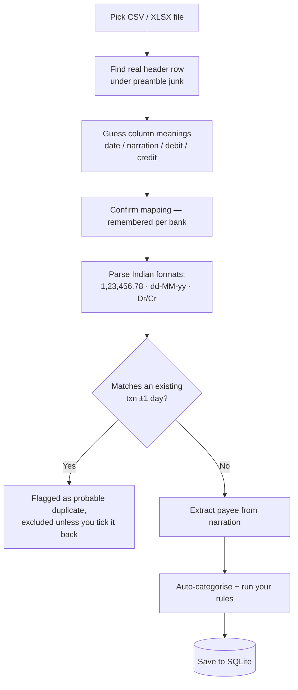
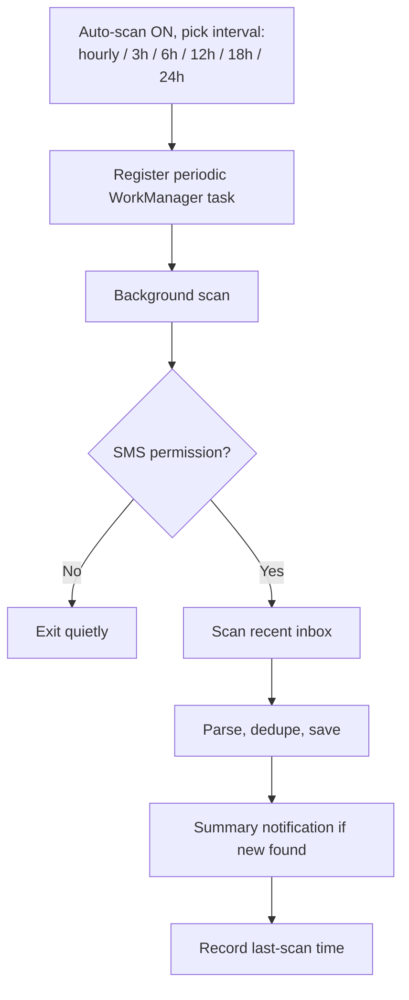
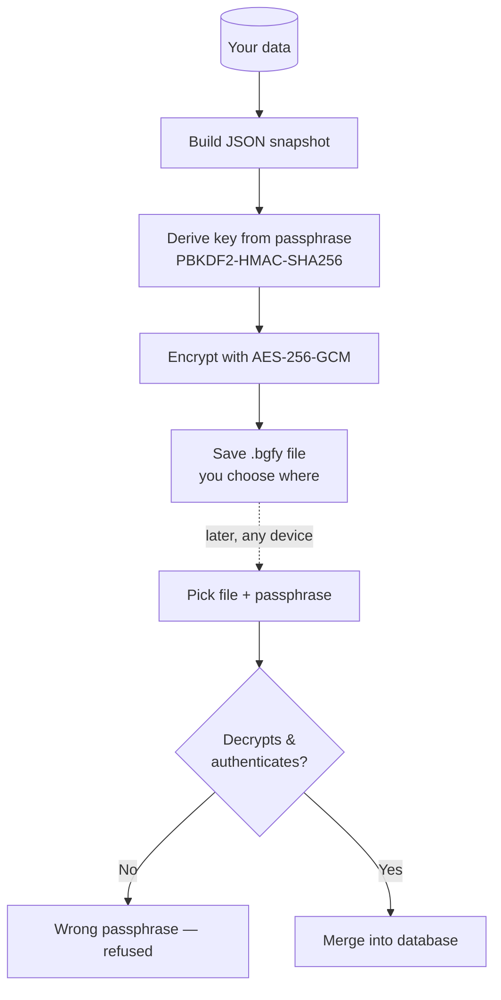
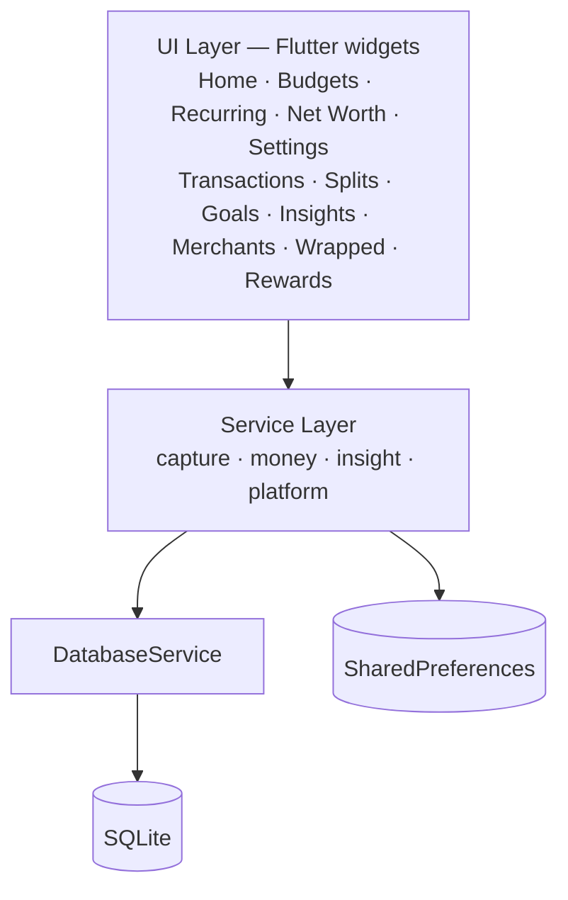

<div align="center">


<br/>

**The private, offline budget tracker that does the work for you.**
Budgetify reads your bank SMS on-device, turns them into a clean spending picture, and never sends a byte off your phone.

<br/>


</div>

---

## Why Budgetify exists

Most people in India already get a text message for **every** bank transaction — UPI, card, ATM, NEFT, the lot. The information needed to understand your spending is *already on your phone*. Yet the popular budgeting apps:

- 📤 **upload your financial life to the cloud** to "sync" it,
- 🧾 **ask you to log every expense by hand** (which nobody keeps up),
- 📺 **bury the experience in ads, upsells, and account creation**, and
- 🔌 **stop working without internet.**

**Budgetify takes the opposite approach.** It reads the transaction SMS your bank already sends, parses them entirely on your device, and builds your budget automatically — **no sign-up, no servers, no internet permission, no ads.** Your money data simply never leaves your phone.

> 💡 **The pitch in one line:** *Automatic, accurate budgeting from the SMS you already receive — fully offline, genuinely private, and beautiful to use.*

---

## What makes it different

| | Budgetify | Typical budgeting app |
|---|---|---|
| **Where your data lives** | 🔒 Only on your device (SQLite) | ☁️ Uploaded to a cloud account |
| **Internet** | 🚫 Not even requested | ✅ Required |
| **Data entry** | 🤖 Automatic from bank SMS | ✍️ Mostly manual |
| **Account / sign-up** | ❌ None | 📧 Email/phone required |
| **Ads & upsells** | ❌ None | 📺 Common |
| **Backups** | 🔐 You own the file (AES-256 encrypted) | Locked in their cloud |
| **Splitting with friends** | 👥 On-device ledger, no accounts for anyone | Everyone must sign up |
| **Works on a plane** | ✈️ Yes | ❌ No |

---

## ✨ Highlights

- 🤖 **Zero-effort tracking** — incoming bank SMS become categorized transactions automatically, in real time and via scheduled background scans.
- 🛡️ **Privacy by architecture** — the app has **no internet permission**. It is technically incapable of uploading your data.
- 🎯 **Accurate by design** — per-bank template packs, strict sender matching, and a review queue that flags low-confidence guesses instead of quietly getting them wrong.
- 📥 **Bring your history** — import CSV/Excel bank statements from any bank for the months the SMS pipeline never saw.
- 🔁 **Recurring payments** — subscriptions, rent, EMIs and bills tracked, reminded, and auto-linked to the debit that pays them.
- 👥 **Split expenses offline** — a Splitwise-style ledger where the other people are just names, not accounts.
- 🎯 **Goals & net worth** — earmark savings toward goals, and track assets, liabilities, SIPs and holdings by hand.
- 🧠 **A money coach that stays quiet** — insights and nudges built on robust statistics, deliberately guarded against crying wolf.
- 🎁 **Monthly Wrapped** — a shareable, theme-aware recap poster (animated GIF optional) that's amount-free unless you reveal the numbers.
- 🏆 **Gamified budgeting** — streaks, achievements, trophies, and a reward road that unlocks themes and royal avatars.
- 💎 **A genuinely premium feel** — a hand-built "midnight ink & champagne gold" theme, the Manrope typeface, glassmorphic surfaces, and tasteful motion throughout.
- 🌏 **Six languages** — English, हिन्दी, मराठी, বাংলা, తెలుగు, and தமிழ்.
- 🔐 **Your data, your keys** — biometric app lock, privacy mode, and passphrase-encrypted backups you can store anywhere.
- 📱 **A home-screen widget** for an at-a-glance read without opening the app.

---

## 📸 Screenshots

> _Drop your device screenshots into `docs/screenshots/` and they'll appear here._

| Home Dashboard | Budget & Analytics | Transaction Detail | Settings |
|:---:|:---:|:---:|:---:|
| _coming soon_ | _coming soon_ | _coming soon_ | _coming soon_ |

<!--
To add screenshots, save PNGs as docs/screenshots/home.png etc. and replace the row above with:
|  |  |  |  |
-->

---

## 🧭 Feature tour



### 🤖 Automatic transaction capture
Budgetify listens for bank SMS and reads your existing inbox so your history is populated from day one. Every credit and debit is detected, de-duplicated, and saved — **without you typing anything.**
**Benefit:** the #1 reason budgets fail is manual logging. Budgetify removes it entirely.

### 🎯 Reliable, regulation-aware parsing
Indian banks send from dozens of sender IDs (`VM-SBIUPI-S`, `JD-MAHABK`, `BV-HDFCBK-T`…). Budgetify:

- matches against a curated list of **1,600+ bank headers** (including SBI Card and cooperative banks),
- understands TRAI's `-S`/`-T`/`-P` routing suffixes and **silently drops promotional (`-P`) messages**,
- ignores OTPs, statements, failed payments, and autopay/standing-instruction reminders,
- parses tricky formats like SBI's bare `"debited by 35.0"` and never mistakes your **available balance** for the transaction amount.

**Because TRAI's DLT regime forces banks to register their SMS templates**, each bank's formats are a small, stable set. So parsing is **template-first**: banks with known formats get their own anchored **template pack** (`lib/services/bank_templates.dart`), tried before anything else. The generic pattern cascade only runs when no template matches — and its output is **graded lower-confidence**.

### 🔍 A review queue instead of silent mistakes
Low-confidence parses aren't hidden — they're **flagged for review** and reachable as a one-tap filter in Transactions. Correcting one **teaches the parser**, so the same format lands right next time. The philosophy: a budgeting app that quietly gets things wrong is worse than one that admits uncertainty.

### 📥 Import bank statements (CSV / Excel)
Settings → **Import Data** → **Bank statement** brings in the history SMS can't see — months from before you installed Budgetify, or an account whose alerts land on another phone. It works with **any bank**: it finds the header row under the preamble junk, guesses what each column means (HDFC/ICICI/SBI/Axis/Kotak spellings built in), understands Indian formats (`1,23,456.78`, `dd-MM-yy`, `Dr`/`Cr` markers, ₹/INR prefixes, bracketed negatives), and asks you to confirm the mapping — confirmed once, it's remembered for that bank.

- **No double counting.** Rows matching the amount and date (±1 day) of a transaction already on the device — usually the SMS copy of the same spend — are flagged as probable duplicates and excluded unless you tick them back in.
- **Balances ignored by design.** The balance column is recognised so detection works, but its values are never read or stored.

There's also an **Axio tag import** for bringing across categories from Axio.

### 🏷️ Effortless organization
Transactions auto-map to categories from merchant keywords (Swiggy → Food, Uber → Transport…). You can re-tag in a tap, create **custom tags with your own emoji**, and save **rules** so similar transactions classify themselves forever. Tag a transfer between your own accounts as **Self Transfer** or money moved into **Investments**, and Budgetify correctly keeps it **out of your spending totals** — because relocating your own money isn't an expense.

### 🔁 Recurring payments
Track the money that leaves on a schedule — subscriptions, rent, EMIs, insurance, utilities, gym. Add a plan with an amount (or mark it **"amount varies"** for bills like electricity), a cadence (**weekly / monthly / quarterly / yearly**), a next-due date and an optional end date.

- **See what's coming.** A dedicated **Recurring** tab lists everything by urgency — overdue first, then due-today, then upcoming — with one-tap **Mark paid** / **Skip**. A **Home card** surfaces the next bills due and hides itself entirely if you track none.
- **Auto-detect from SMS.** Budgetify links a matching bank-SMS debit to the cycle it pays (a ⚡ marks auto-detected ones) and can **suggest** recurring charges it spots in your history — suggestion only, never auto-created. A predicted bill is never counted as spend; only the real debit is, exactly once.
- **Reminders** with **Paid / Skip** actions right in the notification.

### 👥 Split expenses — offline
An offline **split ledger**: a Splitwise you keep entirely on your own device. Split a shared bill **equally** or by **exact amounts**, or just record that **you owe** someone / someone **owes you**. Other people are only **names**, never accounts, and **nothing syncs anywhere**. Per-person balances follow one simple convention — **positive means they owe you** — and the rupee arithmetic floors to whole rupees and hands you the remainder, so the parts always sum back to the total. Settle up when the money actually moves, and share a plain-text summary via WhatsApp if the other person wants a copy.

### 🎯 Savings goals
Earmark money toward what you're saving for, with progress shown as a fillable jar. Contributions are a **tracked earmark** — nothing moves automatically, because Budgetify never touches your accounts. Goals and contributions ride along in the encrypted backup.

### 📈 Net worth, holdings & SIPs
A **Net Worth** tab tracks manually-entered **assets and liabilities** — investments, savings balances, property, debts — plus **SIPs/RDs** and a net-worth projection. Values are entered by you (market values move), and the app **never invents instalments from SMS**: money only moves when you say so, via the Yes/No "Investment Alert" prompt or by entering past instalments up front.

### 🧠 Insights & a money coach that stays quiet
A **Financial health score** (0–100, banded from *at risk* to *excellent*), a **safe-to-spend** figure, **merchant breakdowns**, period comparisons, and plain-language insights ("Food ↑38% vs last month").

The coach behind the nudges is deliberately conservative. Spend is heavily right-skewed and one big purchase wrecks the mean, so it uses the **median and median absolute deviation** — statistics a lone outlier can't drag around. Every threshold exists to keep it quiet unless it has something genuinely worth saying, because *a budgeting app that cries wolf gets muted, then uninstalled.*

### 📊 Analytics that actually inform
- **Budget gauge** with a gold progress ring and threshold alerts at 50/75/90/100%+.
- **Category donut** that groups tiny slices into "Other" so it never looks cluttered.
- **Daily spending curve** with a budget-pace line, plus a spending calendar.
- **Swipeable monthly history** — every past month gets the full picture, not just the current one.
- **Per-category budget insights** for the envelopes you set.

### 🎁 Monthly Wrapped
A shareable, end-of-month **poster** that tells the month's story at a glance: a hero stat, your day-by-day spending rhythm, top categories, biggest mover, and a grid of insights (busiest day, no-spend days, time in app, activity).

- **Amount-free by default.** The card carries only **percentages, counts and names**, so it's safe to post anywhere. A **"reveal numbers"** toggle flips it to real ₹ figures — opt-in, for when you *want* the detail.
- **It wears your theme.** The card dresses itself from the active theme, so every theme — and an equipped royal's court dress — restyles it automatically, and an equipped royal signs it with a small living seal.
- **Animated share.** Export it as a seamlessly looping GIF; the ~24-frame encode hops to a background isolate so it never janks the UI.

Sharing goes through the system share sheet — still no internet permission involved.

### 🏆 Gamified budgeting
On by default, and switchable off in Settings. Daily **streaks** (with freezes, live flame and a heatmap), **achievements**, a **trophy room**, and a **profile card** you can share. The **Streak Reward Road** unlocks as your *longest* streak grows — so a broken streak never re-locks what you earned:

| Streak | Unlocks |
|---|---|
| 3 days | Smoky Ivory theme |
| 7 days | Seashell Mauve theme |
| **10 days** | **A royal pick** — unlock any one ROYALTY avatar |
| 14 days | Onyx Amber theme |
| **24 days** | **A second royal pick** |
| 30 days | Royal Indigo theme |
| 45 days | Midnight Indigo theme |

The **ROYALTY** avatars are fully-animated characters that dress the app's hero surfaces in their own court colours, react to your budgeting, and — if you opt in — bring custom animations and haptics.

### 🔎 Find anything, fast
Search by **payee, amount, or date**, and stack **independent filters** — type (credit/debit) and status (classified / unclassified / needs review) combine freely. A **weekly reminder** nudges you about the month's still-untagged transactions and opens straight to them.

### 🧑‍🏫 A guided tour, not a slideshow
First launch runs a **game-style tutorial**: each step is a coach mark anchored to the real control, and action steps only advance when you actually perform the action — tap a transaction, pick a tag, save it. It then walks you into every section of the app.

### 🔐 Privacy & security you can verify
- **No `INTERNET` permission** in the manifest — uploading is impossible by construction.
- **Privacy mode** masks amounts (`+ ₹1,234.56` → `+ ₹••••`) with a fixed-width mask, so even the magnitude is hidden.
- **Biometric app lock** (fingerprint / face / device PIN) that gates the whole app, with a recovery path.
- **AES-256-GCM encrypted backups** with a PBKDF2 passphrase — restore on any device, store the file wherever you trust.
- **Deletes are permanent** — a removed transaction is tombstoned so background scans never resurrect it.
- **Transitive permissions stripped.** Plugins pull in permissions the app never uses (`another_telephony` declares location; `open_filex` declares the media group). The manifest **pins them out**, so the minimal-offline guarantee is literally true.

### 📤 Exports you own
One tap produces a genuine **Excel `.xlsx`** workbook (with a summary sheet), a **PDF report** (brand header, motto, page numbers), a clean **CSV**, or a formatted **text report** — optionally **filtered** by date range, type, category/tag, or payee. PDF generation is pure-Dart, so it adds no platform channels and no network access.

### 📱 Home-screen widget
Month-to-date spend, budget progress, income, net, and your top spending category — at a glance, without opening the app.

---

## 🔒 The privacy model, visualized

Everything happens inside the phone. There is no server in this diagram because there is no server.



---

## 🛠️ How it works

### App launch → splash → (optional) lock → home



### Real-time SMS → transaction pipeline



### Classification & reusable rules



### Statement import



### Background scheduled scans



### Encrypted backup & restore



---

## 🏗️ Architecture & tech stack

A conventional three-layer split — widgets never touch the database directly, and every service is context-free enough to run from a background isolate.



| Group | Services |
|---|---|
| **Capture** | `SmsParserService` · `BankTemplates` · `SmsService` · `BackgroundService` · `StatementImportService` · `AxioImportService` |
| **Money** | `RecurringService` · `LedgerService` · `SavingsGoalService` · `SipService` |
| **Insight** | `InsightsService` · `CoachService` · `FinancialHealthService` · `RecapService` · `GamificationService` |
| **Platform** | `ExportService` · `BackupService` · `AppLockService` · `NotificationService` · `WidgetService` · `TutorialService` |

| Concern | Choice |
|---|---|
| Framework | **Flutter** (Dart 3) |
| SMS access | `another_telephony` (maintained fork) |
| Local database | `sqflite` (SQLite) |
| Charts | `fl_chart` |
| Background work | `workmanager` |
| Notifications | `flutter_local_notifications` |
| Biometric lock | `local_auth` |
| Backup encryption | `cryptography` (AES-GCM + PBKDF2) |
| Excel export | `excel` |
| PDF export | `pdf` (pure Dart — no network) |
| Statement import | `file_picker` + `excel` + in-house `csv_reader` |
| Sharing | `share_plus` (system share sheet, no INTERNET) |
| Animated Wrapped GIF | `image` (encoded on a background isolate) |
| Home widget | `home_widget` |
| State | `provider` |
| Localization | in-house `AppStrings` tables (6 languages) |
| Typeface | **Manrope** (bundled) |

---

## 🌏 Languages

The whole app — including notifications, exports and reminders — is available in:

| Language | Native name | Code |
|---|---|---|
| English | English | `en` |
| Hindi | हिन्दी | `hi` |
| Marathi | मराठी | `mr` |
| Bengali | বাংলা | `bn` |
| Telugu | తెలుగు | `te` |
| Tamil | தமிழ் | `ta` |

Pick one during onboarding or any time from Settings.

---

## 🔑 Permissions — and why each is needed

Budgetify asks for the **minimum** to do its job. Notably, **`INTERNET` is not in the list.**

| Permission | When | Why |
|---|---|---|
| `RECEIVE_SMS` | Install time | Detect incoming bank SMS in real time |
| `READ_SMS` | Onboarding / permission card | Read existing SMS for the first historical scan and background scans |
| `POST_NOTIFICATIONS` | Android 13+ | Transaction, budget-threshold and bill reminders |
| `USE_BIOMETRIC` | When you enable App Lock | Fingerprint / face unlock |
| `VIBRATE` | Install time (normal permission, no prompt) | Physical rumble for royal avatar reactions |

**No storage permission is requested.** Exports and encrypted backups are written through the Android system file picker (Storage Access Framework), so the app needs none — and `MANAGE_EXTERNAL_STORAGE` ("All files access") is explicitly **pinned out** so it can never reach the shipping app.

> 🛡️ **What's *not* requested:** internet/network access, location, or media access. The app cannot phone home.

---

## 💾 Data & storage

- **SQLite** — transactions, budgets, classification rules, recurring plans, splits & settlements, savings goals, holdings & SIPs, and deletion tombstones.
- **SharedPreferences** — settings (theme, language, auto-scan interval, last scan, app-lock flag, privacy mode, gamified mode, custom tags & emoji, streak state).
- **Backup files** — AES-256-GCM encrypted `.bgfy` snapshots that **you** store and control.
- **No server-side storage of any kind.**

---

## 🚀 Getting started (development)

A standard Flutter project.

```bash
# 1. Install dependencies
flutter pub get

# 2. Static analysis (should be clean)
flutter analyze

# 3. Run the test suite (43 suites: parser, import, export, backup crypto,
#    splits, goals, SIPs, coach stats, gamification, l10n layout…)
flutter test

# 4. Run on a connected Android device
flutter run

# 5. Build a release APK
flutter build apk --release
```

**Requirements:** Flutter SDK (Dart ≥ 3.9), Android SDK, and a physical Android device or emulator. SMS features require a **real device with SMS access** — emulators won't receive bank texts.

---

## 📱 Platform support

| Platform | Status |
|---|---|
| **Android** | ✅ Full functionality — SMS parsing, background scans, notifications, widget, biometric lock |
| **iOS** | ⚠️ iOS does not allow apps to read SMS, so SMS-driven features are unavailable by platform policy |

---

## ❓ FAQ

**Does Budgetify send my messages or transactions anywhere?**
No. There is no internet permission; all parsing and storage happen on-device.

**Will it read my personal (non-bank) messages?**
Only messages from recognized bank senders are processed; everything else is ignored at the source.

**What if a transaction is wrong or spammy?**
Delete it — it's tombstoned so future scans won't bring it back. If the parser wasn't sure, it will already be waiting in the **needs-review** filter; correcting it teaches the parser for next time.

**My bank isn't parsed correctly. Can that be fixed?**
Yes — banks with known formats get a **template pack**. New packs are added from real message samples; drafted formats stay marked unverified so their hits land in the review queue until confirmed.

**Can I bring in history from before I installed the app?**
Yes — import a CSV or Excel statement from your bank. Duplicates against existing SMS transactions are detected and excluded.

**Does the Wrapped card leak my spending?**
Not unless you ask it to. The card is amount-free by default — percentages, counts and names only — so it's safe to post as-is. If you want the real figures on it, there's an explicit **reveal numbers** toggle.

**How do I move my data to a new phone?**
Create an encrypted backup, copy the `.bgfy` file across, and restore it with your passphrase.

**Is my history safe if I lose my phone?**
Enable the biometric App Lock, and keep an encrypted backup somewhere safe.

---

## 🗺️ Roadmap ideas

- PDF bank-statement import (CSV/Excel already supported)
- Subscription **price-increase** & duplicate-charge alerts (builds on recurring)
- Bill-due reminders parsed from "total/min due" SMS
- More bank template packs (PNB, BoB, Canara, Union…) from real samples
- Richer widget sizes

---

## 🔗 Links

- 🌐 [Project site](https://yolo-cell-hash.github.io/budgetify/)
- 🔒 [Privacy policy](https://yolo-cell-hash.github.io/budgetify/privacy-policy/)
- 🗑️ [Data deletion](https://yolo-cell-hash.github.io/budgetify/data-deletion/)
- 📝 [Changelog](CHANGELOG.md)

---

<div align="center">

**Budgetify** — automatic, private, offline budgeting that respects you.

<sub>Built with Flutter. Your data stays yours.</sub>

</div>
