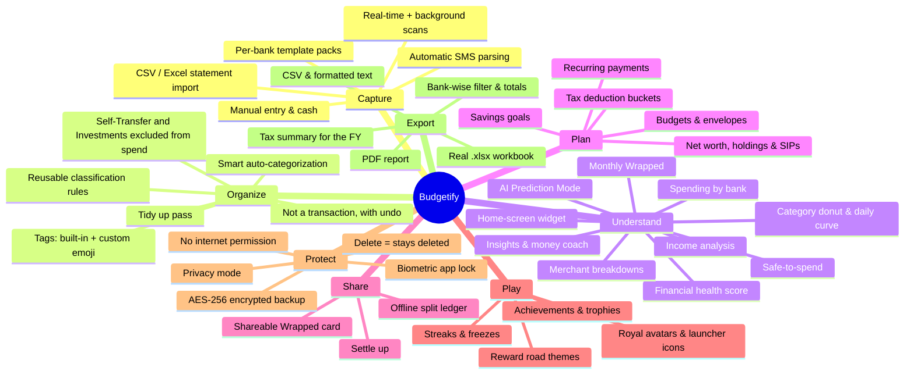
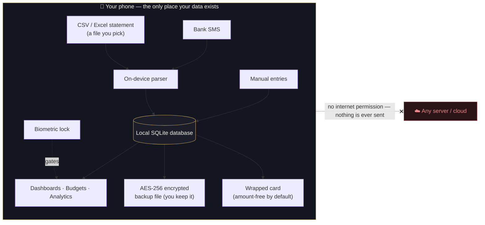
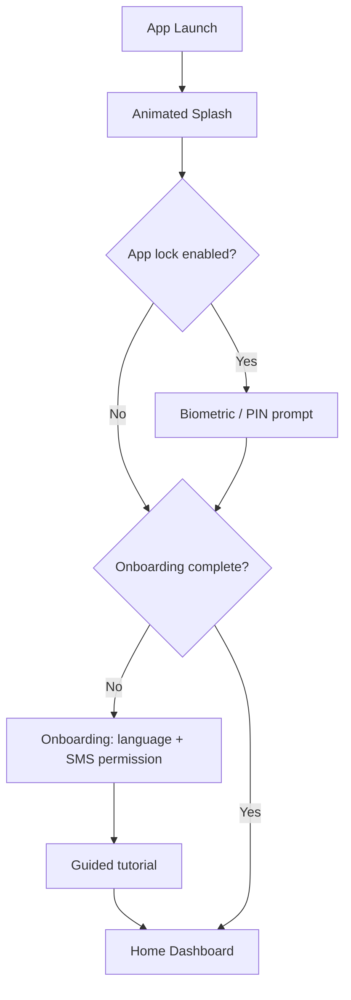
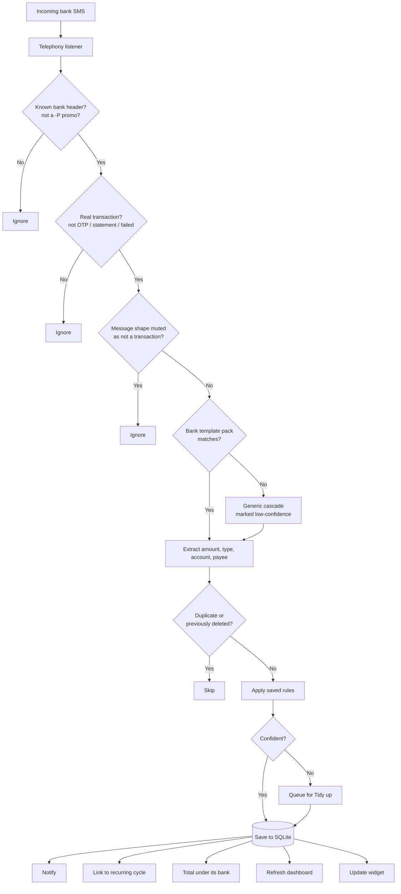
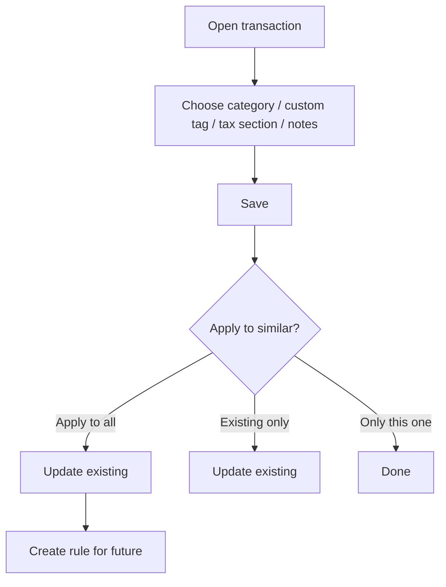
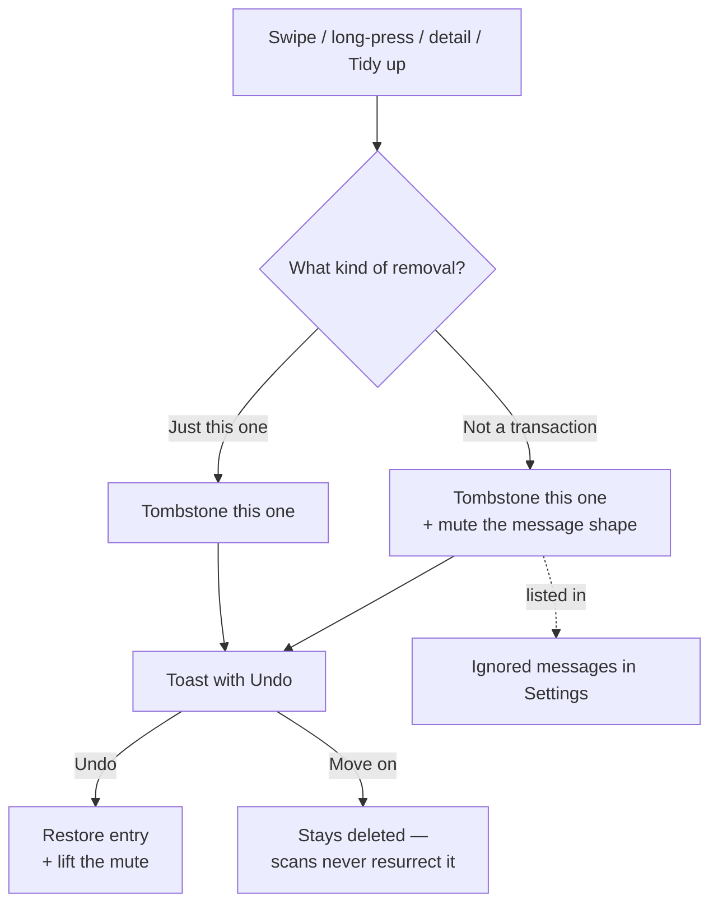
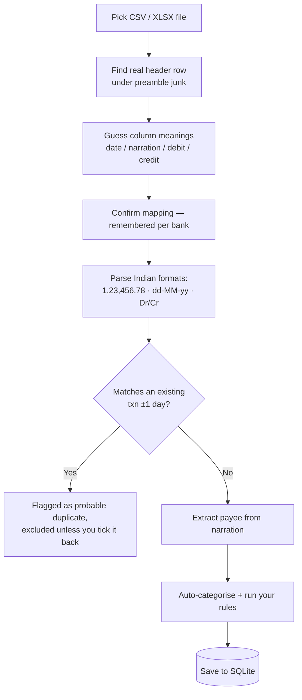
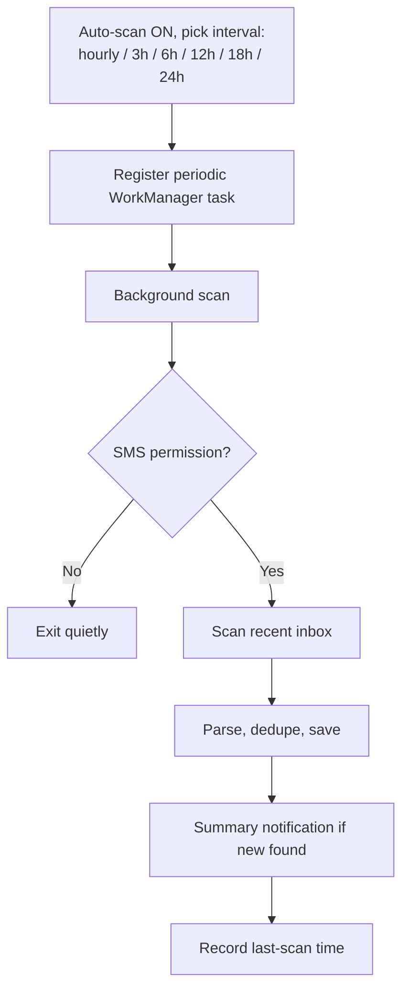
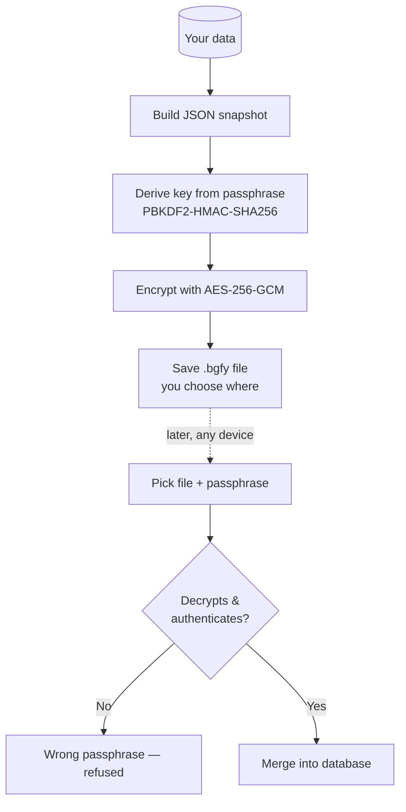
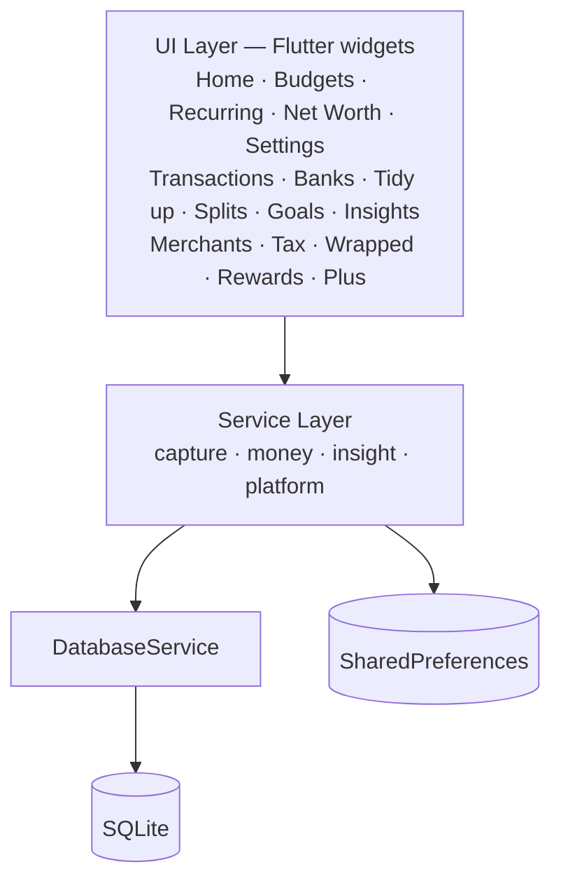

<div align="center">


<br/>

**The private, offline budget tracker that does the work for you.**
Budgetify reads your bank SMS on-device, turns them into a clean spending picture, and never sends a byte off your phone.

<br/>


</div>

---

## Why Budgetify exists

Most people in India already get a text message for **every** bank transaction — UPI, card, ATM, NEFT, the lot. The information needed to understand your spending is *already on your phone*. Yet the popular budgeting apps:

- 📤 **upload your financial life to the cloud** to "sync" it,
- 🧾 **ask you to log every expense by hand** (which nobody keeps up),
- 📺 **bury the experience in ads, upsells, and account creation**, and
- 🔌 **stop working without internet.**

**Budgetify takes the opposite approach.** It reads the transaction SMS your bank already sends, parses them entirely on your device, and builds your budget automatically — **no sign-up, no servers, no internet permission, no ads.** Your money data simply never leaves your phone.

> 💡 **The pitch in one line:** *Automatic, accurate budgeting from the SMS you already receive — fully offline, genuinely private, and beautiful to use.*

---

## What makes it different

| | Budgetify | Typical budgeting app |
|---|---|---|
| **Where your data lives** | 🔒 Only on your device (SQLite) | ☁️ Uploaded to a cloud account |
| **Internet** | 🚫 Not even requested | ✅ Required |
| **Data entry** | 🤖 Automatic from bank SMS | ✍️ Mostly manual |
| **Account / sign-up** | ❌ None | 📧 Email/phone required |
| **Ads & upsells** | ❌ None | 📺 Common |
| **Backups** | 🔐 You own the file (AES-256 encrypted) | Locked in their cloud |
| **Splitting with friends** | 👥 On-device ledger, no accounts for anyone | Everyone must sign up |
| **Tax organiser** | 🧾 80C/80D/HRA… tagged as you spend | Rarely offered |
| **Works on a plane** | ✈️ Yes | ❌ No |

---

## ✨ Highlights

- 🤖 **Zero-effort tracking** — incoming bank SMS become categorized transactions automatically, in real time and via scheduled background scans.
- 🛡️ **Privacy by architecture** — the shipping app has **no internet permission**. It is technically incapable of uploading your data.
- 🎯 **Accurate by design** — per-bank template packs, strict sender matching, and a **Tidy up** pass that surfaces low-confidence guesses instead of quietly getting them wrong.
- 🏦 **Bank-wise everything** — spending totalled per bank, month by month, with filtering, exports, and names you choose.
- 📥 **Bring your history** — import CSV/Excel bank statements from any bank for the months the SMS pipeline never saw.
- 🔁 **Recurring payments** — subscriptions, rent, EMIs and bills tracked, reminded, and auto-linked to the debit that pays them.
- 🧾 **Tax deductions, organised as you go** — tag spends into 80C, 80D, 24(b), HRA and more, and see each section fill toward its cap before year-end.
- 👥 **Split expenses offline** — a Splitwise-style ledger where the other people are just names, not accounts.
- 🎯 **Goals & net worth** — earmark savings toward goals, and track assets, liabilities, SIPs and holdings by hand.
- 🧠 **A money coach that stays quiet** — insights and nudges built on robust statistics, deliberately guarded against crying wolf.
- 🔮 **On-device forecasting** — opt-in AI Prediction Mode projects where the month lands, computed entirely on your phone.
- 🎁 **Monthly Wrapped** — a shareable, theme-aware recap poster that's amount-free unless you reveal the numbers.
- 🏆 **Gamified budgeting** — streaks, freezes, achievements, trophies, and a reward road that unlocks themes, royal avatars and matching launcher icons.
- 💎 **A genuinely premium feel** — a hand-built "midnight ink & champagne gold" theme, the Manrope typeface, glassmorphic surfaces, and tasteful motion throughout.
- 🌏 **Six languages** — English, हिन्दी, मराठी, বাংলা, తెలుగు, and தமிழ்.
- 🔐 **Your data, your keys** — biometric app lock, privacy mode, and passphrase-encrypted backups you can store anywhere.
- ♿ **Built to be usable** — screen-reader labels on the transaction list, long-press as a non-gesture alternative to swiping, and layouts that survive large text sizes in all six languages.
- 📱 **A home-screen widget** for an at-a-glance read without opening the app.

---

## 🆕 Recently shipped

| Version | What landed |
|---|---|
| **1.65** | **One Sunday-morning nudge, alternating** — tag your month's untagged spends one week, check the uncertain entries the next, and nothing at all when there's nothing to do. Both moved off the transaction-alert channel, so muting a reminder no longer mutes your actual transaction alerts |
| **1.64** | **The month's total says how much of it is unchecked** — when the reader wasn't sure about an entry, the hero card names the rupee amount involved right under the figure, and one tap opens the tidy-up queue. Nothing to check, nothing shown |
| **1.63.2** | **Changing your bank's transfer limit is no longer a spend** — HDFC (and every other bank) confirms a new ATM/transfer/card cap by SMS, and the cap was being logged as a payment of that size, every single time it changed. Rows already logged are dropped on upgrade |
| **1.63** | **Tidy up tells you what you just did** — every answer is named against the entry it was given to, with one-tap Undo, a progress bar that moves, and the timestamp promoted so two identical ₹100 credits can't be confused |
| **1.62** | **A credit card arriving is no longer income** — card approval and dispatch promos quote the card's *limit*, and three were sitting in one tester's income as ₹4,00,000 and ₹3,55,000 credits. The upgrade also re-reads history and drops rows today's parser refuses, so old false positives clear themselves |
| **1.61** | **Set each person's share of a split by hand** — type one amount and the people you haven't touched absorb the rest; a warning (never a block) when the parts don't add up to the bill. The transaction list keeps your scroll position when you come back to it |
| **1.56** | **Clearing a tag reaches as far as tagging did** — an explicit *Clear* on the transaction, a new **Auto-tag rules** screen that finally makes "Apply to All" visible, pausable and undoable, and *Clear from N transactions* in Manage Tags. Canara Bank and ICICI ACH credits are read properly |
| **1.55.2** | Transactions saved *before* that fix are re-read on upgrade, so a payee that was really your own account number becomes the person who paid you |
| **1.55.1** | Saraswat card spends are read (they file under their own sender), UPI IDs containing a hyphen name the payer, and the counterparty is never your own account number |
| **1.54 – 1.55** | Bank cards under the month's expenses — every bank gets its own card, sized to divide the row evenly |
| **1.53** | **Spending by bank** end to end: Home strip, Budgets card, list filter, and a **By Bank** block in every export. Rename any bank to what you call it |
| **1.49** | **Tidy up**, the removal fork (**"Not a transaction"** vs *just this one*), **undo that survives a restart**, bulk select, and screen-reader support |
| **1.41 – 1.50** | Budgetify **Plus**: 3 free months of everything, then seven premium features keep running with Plus — with genuine, time-boxed offer windows |
| **1.44 – 1.46** | **Tax deductions** (80C/80CCD(1B)/80D/24(b)/HRA/80G), a tax tile in the transaction quick-action row, tags creatable from Manage tags, a lock screen that wears your theme |
| **1.42 – 1.43** | Streak Save with freeze packs on the reward road; **royal launcher icons** that follow your equipped royal |
| **1.40** | **Income analysis** — flip the Budgets overview from spending to income |

Full history in the [Changelog](CHANGELOG.md).

<!--
Screenshots: save device PNGs as docs/screenshots/home.png, analytics.png,
detail.png, settings.png, then drop this section back in above the feature tour:

## 📸 Screenshots

| Home Dashboard | Budget & Analytics | Transaction Detail | Settings |
|:---:|:---:|:---:|:---:|
|  |  |  |  |
-->

---

## 🧭 Feature tour


```mermaid
mindmap
  root((Budgetify))
    Capture
      Automatic SMS parsing
      Per-bank template packs
      Real-time + background scans
      CSV / Excel statement import
      Manual entry & cash
    Organize
      Smart auto-categorization
      Tags: built-in + custom emoji
      Reusable classification rules
      Tidy up pass
      Not a transaction, with undo
      Self-Transfer and Investments excluded from spend
    Understand
      Financial health score
      Safe-to-spend
      Insights & money coach
      AI Prediction Mode
      Category donut & daily curve
      Income analysis
      Merchant breakdowns
      Spending by bank
      Monthly Wrapped
      Home-screen widget
    Plan
      Budgets & envelopes
      Recurring payments
      Savings goals
      Net worth, holdings & SIPs
      Tax deduction buckets
    Share
      Offline split ledger
      Settle up
      Shareable Wrapped card
    Play
      Streaks & freezes
      Achievements & trophies
      Reward road themes
      Royal avatars & launcher icons
    Protect
      No internet permission
      Biometric app lock
      Privacy mode
      AES-256 encrypted backup
      Delete = stays deleted
    Export
      Real .xlsx workbook
      PDF report
      CSV & formatted text
      Bank-wise filter & totals
      Tax summary for the FY
```

### 🤖 Automatic transaction capture
Budgetify listens for bank SMS and reads your existing inbox so your history is populated from day one. Every credit and debit is detected, de-duplicated, and saved — **without you typing anything.**
**Benefit:** the #1 reason budgets fail is manual logging. Budgetify removes it entirely.

### 🎯 Reliable, regulation-aware parsing
Indian banks send from dozens of sender IDs (`VM-SBIUPI-S`, `JD-MAHABK`, `BV-HDFCBK-T`…). Budgetify:

- matches against a curated list of **1,670+ bank headers** (including SBI Card and cooperative banks),
- understands TRAI's `-S`/`-T`/`-P` routing suffixes and **silently drops promotional (`-P`) messages**,
- ignores OTPs, statements, failed payments, and autopay/standing-instruction reminders,
- parses tricky formats like SBI's bare `"debited by 35.0"` and never mistakes your **available balance** for the transaction amount.

**Because TRAI's DLT regime forces banks to register their SMS templates**, each bank's formats are a small, stable set. So parsing is **template-first**: banks with known formats (ICICI, HDFC, Kotak, IPPB, Bank of Maharashtra) get their own anchored **template pack** (`lib/services/bank_templates.dart`), tried before anything else. The generic pattern cascade only runs when no template matches — and its output is **graded lower-confidence**.

### 🧹 Tidy up — a short pass, not silent mistakes
Entries the reader wasn't sure about aren't hidden and aren't guessed at. They're gathered into **Tidy up**: one card at a time, three answers — **Looks right**, **change the direction**, or **Not a transaction** — and a plain finish when the queue is empty. A prompt appears on **Home** only when something is waiting, and disappears the moment it isn't. Low-confidence entries are also reachable as a one-tap **needs review** filter in Transactions.

Correcting one **teaches the parser**, so the same format lands right next time. The philosophy: a budgeting app that quietly gets things wrong is worse than one that admits uncertainty.

### 🗑️ Removal that asks what you actually meant
Deleting used to mean one thing, which was wrong half the time: a recurring promo you deleted came back next month with a new amount. Removal now forks, everywhere it can happen — swipe, detail screen, bulk selection, Tidy up:

- **Not a transaction** — removes this one *and* mutes every future message matching that shape from that sender.
- **Just remove this one** — tombstones this entry only, so background scans never resurrect it.

Both are **undoable** from the toast, and undo **survives an app restart** — the removed entry is kept whole until you move on. Muted shapes are listed under **Settings → Ignored messages**, with a count, so a mute is always visible and always reversible.

**Select several at once** with a long-press — which doubles as a non-gesture alternative to swiping — and remove the lot in one go.

### 📥 Import bank statements (CSV / Excel)
Settings → **Import Data** → **Bank statement** brings in the history SMS can't see — months from before you installed Budgetify, or an account whose alerts land on another phone. It works with **any bank**: it finds the header row under the preamble junk, guesses what each column means (HDFC/ICICI/SBI/Axis/Kotak spellings built in), understands Indian formats (`1,23,456.78`, `dd-MM-yy`, `Dr`/`Cr` markers, ₹/INR prefixes, bracketed negatives), and asks you to confirm the mapping — confirmed once, it's remembered for that bank.

- **No double counting.** Rows matching the amount and date (±1 day) of a transaction already on the device — usually the SMS copy of the same spend — are flagged as probable duplicates and excluded unless you tick them back in.
- **Balances ignored by design.** The balance column is recognised so detection works, but its values are never read or stored.
- **They join the right bank.** An imported statement merges into the bank its label names, so "HDFC Savings" lands with HDFC Bank rather than starting a row of its own.

There's also an **Axio tag import** for bringing across categories from Axio.

### 🏷️ Effortless organization
Transactions auto-map to categories from merchant keywords (Swiggy → Food, Uber → Transport…). You can re-tag in a tap, create **custom tags with your own emoji** — from the tag picker or straight from **Manage tags** — and save **rules** so similar transactions classify themselves forever. Tag a transfer between your own accounts as **Self Transfer** or money moved into **Investments**, and Budgetify correctly keeps it **out of your spending totals** — because relocating your own money isn't an expense.

### 🔁 Recurring payments
Track the money that leaves on a schedule — subscriptions, rent, EMIs, insurance, utilities, gym. Add a plan with an amount (or mark it **"amount varies"** for bills like electricity), a cadence (**weekly / monthly / quarterly / yearly**), a next-due date and an optional end date.

- **See what's coming.** A dedicated **Recurring** tab lists everything by urgency — overdue first, then due-today, then upcoming — with one-tap **Mark paid** / **Skip**. A **Home card** surfaces the next bills due and hides itself entirely if you track none.
- **Auto-detect from SMS.** Budgetify links a matching bank-SMS debit to the cycle it pays (a ⚡ marks auto-detected ones) and can **suggest** recurring charges it spots in your history — suggestion only, never auto-created. A predicted bill is never counted as spend; only the real debit is, exactly once.
- **Reminders** with **Paid / Skip** actions right in the notification.

### 🧾 Tax deductions — an organiser, not tax advice
A second, optional label on any transaction, sitting **next to** its spending category: one ₹12,000 LIC payment is category *Insurance* **and** tax section *80C*. Open a transaction → the **Tax** tile in the quick-action row (beside Split, Recurring and Settle up) → file it under **80C**, **80CCD(1B)**, **80D**, **24(b)**, **HRA** or **80G**. **Settings → Data → Tax Deductions** totals every section for a financial year (Apr–Mar), so filing season isn't a scramble to reconstruct a year of insurance, ELSS, rent and donations.

- **Fills toward the legal cap.** 80C / 80CCD(1B) / 80D / 24(b) show a used-vs-cap bar and remaining headroom — *"₹90,000 of ₹1,50,000 — ₹60,000 left"* — so you can see **before** year-end whether investing a little more would still save tax. Caps are editable, because statutory limits change.
- **Honest about what it can't sum.** HRA and 80G are shown as **evidence** (total rent paid, total donations) with a plain note that the deductible figure depends on your salary or the charity. Never presented as a settled deduction.
- **Regime-aware.** A one-time regime setting (Old / New / Not sure). Under the new regime — which disallows most of these — the screen shows a short explainer instead of buckets, so it never implies savings you can't claim.
- **Suggests the section for you.** Budgetify recognises common payees — LIC and other life insurers → 80C, health insurers → 80D, NPS → 80CCD(1B) — and offers a one-tap *"Looks like Section 80D"* chip. Suggestion only; you always confirm. Choose **Apply to all** to tag every payment to that payee, now and in future.
- **It totals only what you tag.** Your CA or the tax portal decides what's deductible; a standing disclaimer says so.

Fully on-device, included in encrypted backups, and it needs no new permissions.

### 👥 Split expenses — offline
An offline **split ledger**: a Splitwise you keep entirely on your own device. Split a shared bill **equally** or by **exact amounts**, or just record that **you owe** someone / someone **owes you**. Other people are only **names**, never accounts, and **nothing syncs anywhere**. Per-person balances follow one simple convention — **positive means they owe you** — and the rupee arithmetic floors to whole rupees and hands you the remainder, so the parts always sum back to the total. Settle up when the money actually moves, and share a plain-text summary via WhatsApp if the other person wants a copy.

### 🎯 Savings goals
Earmark money toward what you're saving for, with progress shown as a fillable jar. Contributions are a **tracked earmark** — nothing moves automatically, because Budgetify never touches your accounts. Goals and contributions ride along in the encrypted backup.

### 📈 Net worth, holdings & SIPs
A **Net Worth** tab tracks manually-entered **assets and liabilities** — investments, savings balances, property, debts — plus **SIPs/RDs** and a net-worth projection. Values are entered by you (market values move), and the app **never invents instalments from SMS**: money only moves when you say so, via the Yes/No "Investment Alert" prompt or by entering past instalments up front.

### 🧠 Insights & a money coach that stays quiet
A **Financial health score** (0–100, banded from *at risk* to *excellent*), a **safe-to-spend** figure, **merchant breakdowns**, period comparisons, and plain-language insights ("Food ↑38% vs last month").

The coach behind the nudges is deliberately conservative. Spend is heavily right-skewed and one big purchase wrecks the mean, so it uses the **median and median absolute deviation** — statistics a lone outlier can't drag around. Every threshold exists to keep it quiet unless it has something genuinely worth saying, because *a budgeting app that cries wolf gets muted, then uninstalled.*

### 🔮 AI Prediction Mode
Opt-in and **off by default**. Turn it on and Home gains a forecast card: where this month is heading at your current pace, plus the insights that fall out of it. Every number is computed **on your device** from your own history — there is no model call, no upload, and no network path for one to travel down. Turn it off and the card is simply gone.

### 📊 Analytics that actually inform
- **Budget gauge** with a gold progress ring and threshold alerts at 50/75/90/100%+.
- **Category donut** that groups tiny slices into "Other" so it never looks cluttered.
- **Daily spending curve** with a budget-pace line, plus a spending calendar.
- **Income analysis** — flip the Budgets overview from *expenses* to *income* and the same cards answer the other question: where it came from, the daily rhythm, and your top payers. Self-transfers and investment redemptions are excluded, because moving your own money back isn't income.
- **Swipeable monthly history** — every past month gets the full picture, not just the current one.
- **Per-category budget insights** for the envelopes you set.

### 🏦 Bank-wise spending
The sender header on every alert says which bank it came from — `HDFCBK`, `BOIIND`, `SBIUPI`, `ICICIB`, `AXISBK` — so Budgetify totals your spending **per bank**, month by month. Each month lists **only the banks you actually used**: three accounts with one card in use is a one-row month, and the month a dormant account wakes up it shows on its own. Self-transfers, investments and settlements are reported as *moved*, never as spend.

It shows up where you already are: a strip of **bank cards** on **Home** under the month's expenses (each with an accent dot, the bank's name and what you spent from it), a **By bank** card in **Budgets → Overview**, a one-tap bank filter on the **transactions list**, and bank chips in the **export sheet**. Tap any bank for its transactions.

**Rename any bank** to what you actually call it — "HDFC Salary", or a real name for a header the registry doesn't cover. The name is a label only: transactions stay wired to the sender header, so nothing moves between rows and one name covers every header that bank sends from. Names appear everywhere the bank does, exports included, and are carried in encrypted backups.

**A header we can't name still counts.** An unrecognised sender keeps its raw header as its identity, so its spending is totalled, filtered and exported like any other bank — a co-operative bank outside the registry is never silently dropped. It's labelled *"<header> · Unknown bank"* rather than passing itself off as a bank named "JUPITR".

The registry behind it maps **1,525 DLT sender headers to 610 banks** (`lib/services/bank_directory_data.dart`, regenerated from `list_of_banks.txt` by `tool/gen_bank_directory.py`), which is what collapses the 273 headers State Bank of India files under into a single row.

### 🎁 Monthly Wrapped
A shareable, end-of-month **poster** that tells the month's story at a glance: a hero stat, your day-by-day spending rhythm, top categories, biggest mover, and a grid of insights (busiest day, no-spend days, time in app, activity).

- **Amount-free by default.** The card carries only **percentages, counts and names**, so it's safe to post anywhere. A **"reveal numbers"** toggle flips it to real ₹ figures — opt-in, for when you *want* the detail.
- **It wears your theme.** The card dresses itself from the active theme, so every theme — and an equipped royal's court dress — restyles it automatically, and an equipped royal signs it with a small living seal.

Sharing goes through the system share sheet — still no internet permission involved.

### 🏆 Gamified budgeting
On by default, and switchable off in Settings. Daily **streaks** (with freezes, live flame and a heatmap), **achievements**, a **trophy room**, and a **profile card** you can share. The **Streak Reward Road** unlocks as your *longest* streak grows — so a broken streak never re-locks what you earned:

| Streak | Unlocks |
|---|---|
| 3 days | Smoky Ivory theme |
| 5 days | 🧊 1 Streak Freeze |
| 7 days | Seashell Mauve theme |
| **10 days** | **A royal pick** — unlock any one ROYALTY avatar |
| 14 days | Onyx Amber theme |
| 18 days | 🧊 2 Streak Freezes |
| **24 days** | **A second royal pick** |
| 30 days | Royal Indigo theme |
| 36 days | 🧊 2 Streak Freezes |
| 45 days | Midnight Indigo theme |
| 52 days | 🧊 2 Streak Freezes |
| **60 days** | **Vellum theme** — parchment cards on near-black paper stock |

**Streak Freezes** cover a missed day so one busy Tuesday doesn't erase five weeks. They stack from the road and from regular intervals, and a freeze can be applied retroactively to save a streak you've already broken.

The **ROYALTY** avatars are fully-animated characters that dress the app's hero surfaces in their own court colours, react to your budgeting, and — if you opt in — bring custom animations and haptics. Six of them, each with its own court: the Sovereign, the Empress, the Prince, the Dark Prince, the Princess, and the Royal Medic.

**Your launcher icon can follow them.** Opt in and the home-screen icon switches to the gem that matches your equipped royal — bronze, silver, emerald, golden, ruby or amethyst. Android restarts the app to swap an icon, so Budgetify asks you to confirm first, and only on save.

### 🔎 Find anything, fast
Search by **payee, amount, or date**, and stack **independent filters** — type (credit/debit), status (classified / unclassified / needs review) and **bank** combine freely. A **weekly reminder** nudges you about the month's still-untagged transactions and opens straight to them.

### 🧑‍🏫 A guided tour, not a slideshow
First launch runs a **game-style tutorial**: each step is a coach mark anchored to the real control, and action steps only advance when you actually perform the action — tap a transaction, pick a tag, save it. It then walks you into every section of the app.

### ♿ Usable, not just pretty
- **The transaction list reads properly.** Each row is announced to a screen reader as a single sentence — direction, amount, payee, category, date — and removal is exposed as a real accessibility action rather than being swipe-only.
- **Long-press instead of swipe**, for anyone who can't swipe reliably.
- **Large text is a supported size, not a bug report.** Badges wrap instead of clipping, big amounts shrink to fit, and dialogs scroll rather than pushing their own buttons out of reach — in all six languages.
- **Theme-aware attention badges**, so "Unclassified" and "Check" stay legible on every theme.

### 🔐 Privacy & security you can verify
- **No `INTERNET` permission** in the shipping app — the release manifest strips it, so uploading is impossible by construction. (Debug builds keep it only for Flutter's hot reload.)
- **Privacy mode** masks amounts (`+ ₹1,234.56` → `+ ₹••••`) with a fixed-width mask, so even the magnitude is hidden.
- **Biometric app lock** (fingerprint / face / device PIN) that gates the whole app, with a recovery path — and a lock screen that wears your chosen theme.
- **AES-256-GCM encrypted backups** with a PBKDF2 passphrase — restore on any device, store the file wherever you trust.
- **Deletes are permanent** — a removed transaction is tombstoned so background scans never resurrect it.
- **Transitive permissions stripped.** Plugins pull in permissions the app never uses (`another_telephony` declares location; `open_filex` declares the media group). The manifest **pins them out**, so the minimal-offline guarantee is literally true.

### 📤 Exports you own
One tap produces a genuine **Excel `.xlsx`** workbook (summary sheet plus a **By Bank** sheet, per month), a **PDF report** (brand header, motto, page numbers), a clean **CSV**, or a formatted **text report** — optionally **filtered** by date range, type, **bank**, category/tag, or payee. There's also a **Tax Summary** export for a financial year. PDF generation is pure-Dart, so it adds no platform channels and no network access.

Exports agree with the app: self-transfers, investments and settlements sit on their own **Moved (not counted)** line rather than inflating Total Expenses, and split transactions count your share — exactly as every screen shows them.

### 📱 Home-screen widget
Month-to-date spend, budget progress, income, net, and your top spending category — at a glance, without opening the app.

---

## 💎 Budgetify Plus

**No ads, ever, and the app itself is free.** Your first **three months** include every premium feature too, so nothing is behind a wall while you're deciding whether Budgetify is for you.

After that, seven features keep running with **Plus**:

| Plus feature | What it covers |
|---|---|
| Per-category budgets | Creating new envelopes and their threshold alerts |
| Spending notifications | The "₹X debited / ₹Y credited" alerts |
| Bill reminders | Recurring-payment prompts (noon + 8 PM follow-up) |
| Investment reminders | The "Investment Alert" prompts for SIP/RD instalments |
| Apply to all | Tagging a merchant's future *and* existing transactions in one go |
| AI Prediction Mode | The forecast card and the predictions behind it |
| Tax summary export | Exporting the financial-year deduction summary |

**Everything else stays free.** SMS detection itself, the overall monthly budget and its alerts, tagging any transaction, applying a tag to a merchant's existing transactions, splits, goals, net worth, Wrapped, all exports except the tax summary, backups — and **tagging into tax sections plus reading the on-screen totals**. A lapsed subscription never traps your data: nothing is deleted, and locked features simply go quiet until Plus comes back.

| Plan | Everyday price | On offer |
|---|---|---|
| Monthly | ₹49 | ₹29 |
| Yearly | ₹499 | ₹299 |
| **Lifetime** (one-time) | **₹1,499** | **₹999** |
| A royal avatar (one-time, each) | ₹49 | ₹29 |

**The struck-through price is a real one.** Offers open in three narrow windows — the **welcome week** after your free months end, a **festive week** (Holi, Eid al-Fitr, Dussehra, Diwali, and the run-up to New Year's Day), and the **Republic Day / Independence Day** long weekends. Together the recurring ones run 41 days a year, so the everyday price is what applies for roughly **89% of the calendar** — and a test fails the build if that ratio ever creeps the wrong way. A permanent "discount" from a number nobody pays isn't a discount.

> ⏳ **Status:** the free window and the gates are live; **purchases open once Google Play billing is approved**, and the app says so plainly. When it lands it will run over Play Billing's **local IPC to the Play Store app** — so Budgetify can take a payment while still shipping without the `INTERNET` permission.

---

## 🔒 The privacy model, visualized

Everything happens inside the phone. There is no server in this diagram because there is no server.


```mermaid
flowchart LR
  subgraph PHONE["📱 Your phone — the only place your data exists"]
    direction TB
    SMS["Bank SMS"] --> P["On-device parser"]
    ST["CSV / Excel statement<br/>(a file you pick)"] --> P
    M["Manual entries"] --> DB[("Local SQLite database")]
    P --> DB
    DB --> UI["Dashboards · Budgets · Analytics"]
    DB --> BK["AES-256 encrypted<br/>backup file (you keep it)"]
    DB --> W["Wrapped card<br/>(amount-free by default)"]
    LOCK["Biometric lock"] -.gates.-> UI
  end
  CLOUD["☁️ Any server / cloud"]
  PHONE -. "no internet permission — nothing is ever sent" .-x CLOUD

  style PHONE fill:#14161F,stroke:#C8A75E,color:#F2F2EF
  style CLOUD fill:#2A1416,stroke:#E8888C,color:#E8888C
  style DB fill:#1B1E28,stroke:#C8A75E,color:#F2F2EF
```

---

## 🛠️ How it works

### App launch → splash → (optional) lock → home


```mermaid
flowchart TD
  A[App Launch] --> S[Animated Splash]
  S --> L{App lock enabled?}
  L -- Yes --> Bio[Biometric / PIN prompt]
  L -- No --> O{Onboarding complete?}
  Bio --> O
  O -- No --> ON[Onboarding: language + SMS permission]
  ON --> Tour[Guided tutorial]
  Tour --> Home[Home Dashboard]
  O -- Yes --> Home
```

### Real-time SMS → transaction pipeline


```mermaid
flowchart TD
  SMS[Incoming bank SMS] --> Listen[Telephony listener]
  Listen --> Sender{Known bank header?<br/>not a -P promo?}
  Sender -- No --> Drop1[Ignore]
  Sender -- Yes --> Kind{Real transaction?<br/>not OTP / statement / failed}
  Kind -- No --> Drop2[Ignore]
  Kind -- Yes --> Muted{Message shape muted<br/>as not a transaction?}
  Muted -- Yes --> Drop4[Ignore]
  Muted -- No --> Tpl{Bank template pack<br/>matches?}
  Tpl -- Yes --> Ex[Extract amount, type, account, payee]
  Tpl -- No --> Gen[Generic cascade<br/>marked low-confidence]
  Gen --> Ex
  Ex --> Dup{Duplicate or<br/>previously deleted?}
  Dup -- Yes --> Drop3[Skip]
  Dup -- No --> Rule[Apply saved rules]
  Rule --> Conf{Confident?}
  Conf -- No --> RQ[Queue for Tidy up]
  Conf -- Yes --> Save
  RQ --> Save[(Save to SQLite)]
  Save --> Note[Notify]
  Save --> Rec[Link to recurring cycle]
  Save --> Bank[Total under its bank]
  Save --> Refresh[Refresh dashboard]
  Save --> Widget[Update widget]
```

### Classification & reusable rules


```mermaid
flowchart TD
  Open[Open transaction] --> Pick[Choose category / custom tag / tax section / notes]
  Pick --> Save[Save]
  Save --> Q{Apply to similar?}
  Q -- Apply to all --> All[Update existing] --> RF[Create rule for future]
  Q -- Existing only --> Ex[Update existing]
  Q -- Only this one --> Done[Done]
```

### Removing an entry


```mermaid
flowchart TD
  Sw[Swipe / long-press / detail / Tidy up] --> Ask{What kind of removal?}
  Ask -- Not a transaction --> Mute[Tombstone this one<br/>+ mute the message shape]
  Ask -- Just this one --> Tomb[Tombstone this one]
  Mute --> Toast[Toast with Undo]
  Tomb --> Toast
  Toast -- Undo --> Restore[Restore entry<br/>+ lift the mute]
  Toast -- Move on --> Gone[Stays deleted —<br/>scans never resurrect it]
  Mute -.listed in.-> Ign[Ignored messages in Settings]
```

### Statement import


```mermaid
flowchart TD
  F[Pick CSV / XLSX file] --> H[Find real header row<br/>under preamble junk]
  H --> Map[Guess column meanings<br/>date / narration / debit / credit]
  Map --> Conf[Confirm mapping — remembered per bank]
  Conf --> Parse[Parse Indian formats:<br/>1,23,456.78 · dd-MM-yy · Dr/Cr]
  Parse --> Dup{Matches an existing<br/>txn ±1 day?}
  Dup -- Yes --> Excl[Flagged as probable duplicate,<br/>excluded unless you tick it back]
  Dup -- No --> Pay[Extract payee from narration]
  Pay --> Cat[Auto-categorise + run your rules]
  Cat --> Save[(Save to SQLite)]
```

### Background scheduled scans


```mermaid
flowchart TD
  Set[Auto-scan ON, pick interval:<br/>hourly / 3h / 6h / 12h / 18h / 24h] --> Reg[Register periodic WorkManager task]
  Reg --> Task[Background scan]
  Task --> Perm{SMS permission?}
  Perm -- No --> Stop[Exit quietly]
  Perm -- Yes --> Scan[Scan recent inbox]
  Scan --> Parse[Parse, dedupe, save]
  Parse --> Sum[Summary notification if new found]
  Sum --> Rec[Record last-scan time]
```

### Encrypted backup & restore


```mermaid
flowchart TD
  D[(Your data)] --> J[Build JSON snapshot]
  J --> K[Derive key from passphrase<br/>PBKDF2-HMAC-SHA256]
  K --> E[Encrypt with AES-256-GCM]
  E --> F[Save .bgfy file<br/>you choose where]
  F -. "later, any device" .-> R[Pick file + passphrase]
  R --> V{Decrypts &<br/>authenticates?}
  V -- No --> Err[Wrong passphrase — refused]
  V -- Yes --> Merge[Merge into database]
```

---

## 🏗️ Architecture & tech stack

A conventional three-layer split — widgets never touch the database directly, and every service is context-free enough to run from a background isolate.


```mermaid
flowchart TD
  UI["UI Layer — Flutter widgets<br/>Home · Budgets · Recurring · Net Worth · Settings<br/>Transactions · Banks · Tidy up · Splits · Goals · Insights<br/>Merchants · Tax · Wrapped · Rewards · Plus"]
  SVC["Service Layer<br/>capture · money · insight · platform"]
  UI --> SVC
  SVC --> DBService["DatabaseService"]
  SVC --> Prefs[("SharedPreferences")]
  DBService --> SQLite[("SQLite")]
```

| Group | Services |
|---|---|
| **Capture** | `SmsParserService` · `BankTemplates` · `SmsService` · `BackgroundService` · `StatementImportService` · `AxioImportService` · `RemovalService` |
| **Money** | `RecurringService` · `LedgerService` · `SavingsGoalService` · `SipService` · `TaxService` |
| **Insight** | `InsightsService` · `CoachService` · `FinancialHealthService` · `RecapService` · `GamificationService` |
| **Banks** | `BankDirectory` (+ generated `bank_directory_data`) · `BankAliasService` |
| **Platform** | `ExportService` · `BackupService` · `AppLockService` · `NotificationService` · `WidgetService` · `TutorialService` · `AppIconService` |
| **Commerce** | `EntitlementService` · `BillingService` |

| Concern | Choice |
|---|---|
| Framework | **Flutter** (Dart 3) |
| SMS access | `another_telephony` (maintained fork) |
| Local database | `sqflite` (SQLite) |
| Charts | `fl_chart` |
| Background work | `workmanager` |
| Notifications | `flutter_local_notifications` |
| Biometric lock | `local_auth` |
| Backup encryption | `cryptography` (AES-GCM + PBKDF2) |
| Excel export | `excel` |
| PDF export | `pdf` (pure Dart — no network) |
| Statement import | `file_picker` + `excel` + in-house `csv_reader` |
| Sharing | `share_plus` (system share sheet, no INTERNET) |
| Home widget | `home_widget` |
| State | `provider` |
| Localization | in-house `AppStrings` tables (6 languages) |
| Typeface | **Manrope** (bundled) |

---

## 🌏 Languages

The whole app — including notifications, exports and reminders — is available in:

| Language | Native name | Code |
|---|---|---|
| English | English | `en` |
| Hindi | हिन्दी | `hi` |
| Marathi | मराठी | `mr` |
| Bengali | বাংলা | `bn` |
| Telugu | తెలుగు | `te` |
| Tamil | தமிழ் | `ta` |

Pick one during onboarding or any time from Settings.

---

## 🔑 Permissions — and why each is needed

Budgetify asks for the **minimum** to do its job. Notably, **`INTERNET` is not in the list.**

| Permission | When | Why |
|---|---|---|
| `RECEIVE_SMS` | Install time | Detect incoming bank SMS in real time |
| `READ_SMS` | Onboarding / permission card | Read existing SMS for the first historical scan and background scans |
| `POST_NOTIFICATIONS` | Android 13+ | Transaction, budget-threshold and bill reminders |
| `USE_BIOMETRIC` | When you enable App Lock | Fingerprint / face unlock |
| `VIBRATE` | Install time (normal permission, no prompt) | Physical rumble for royal avatar reactions |

**No storage permission is requested.** Exports and encrypted backups are written through the Android system file picker (Storage Access Framework), so the app needs none — and `MANAGE_EXTERNAL_STORAGE` ("All files access") is explicitly **pinned out** so it can never reach the shipping app.

> 🛡️ **What's *not* requested:** internet/network access, location, or media access. The app cannot phone home.

---

## 💾 Data & storage

- **SQLite** — transactions, budgets, classification rules, recurring plans, splits & settlements, savings goals, holdings & SIPs, tax-section tags, bank names, and deletion tombstones.
- **SharedPreferences** — settings (theme, language, auto-scan interval, last scan, app-lock flag, privacy mode, AI Prediction Mode, gamified mode, custom tags & emoji, streak state, entitlement cache).
- **Backup files** — AES-256-GCM encrypted `.bgfy` snapshots that **you** store and control.
- **No server-side storage of any kind.**

---

## 🚀 Getting started (development)

A standard Flutter project.

```bash
# 1. Install dependencies
flutter pub get

# 2. Static analysis (should be clean)
flutter analyze

# 3. Run the test suite
flutter test

# 4. Run on a connected Android device
flutter run

# 5. Build a release APK
flutter build apk --release
```

The suite is **61 test files** covering the parser gate and its misparse corpus, statement import, exports, backup crypto, splits, goals, SIPs, tax buckets, coach statistics, gamification, entitlements, and localized layout.

**Requirements:** Flutter SDK (Dart ≥ 3.9), Android SDK, and a physical Android device or emulator. SMS features require a **real device with SMS access** — emulators won't receive bank texts.

> ⚠️ This repo predates the current Dart formatter. **Don't run `dart format`** across it — match the surrounding style by hand instead.

---

## 📱 Platform support

| Platform | Status |
|---|---|
| **Android** | ✅ Full functionality — SMS parsing, background scans, notifications, widget, biometric lock |
| **iOS** | ⚠️ iOS does not allow apps to read SMS, so SMS-driven features are unavailable by platform policy |

---

## ❓ FAQ

**Does Budgetify send my messages or transactions anywhere?**
No. The shipping app has no internet permission; all parsing and storage happen on-device.

**Will it read my personal (non-bank) messages?**
Only messages from recognized bank senders are processed; everything else is ignored at the source.

**What if a transaction is wrong or spammy?**
Remove it and pick what you meant: **Not a transaction** also mutes that message shape from that sender, so the same promo doesn't come back next month; **Just remove this one** tombstones that entry alone. Either way you get an **Undo** that survives a restart. If the parser wasn't sure to begin with, it's already waiting in **Tidy up**.

**My bank isn't parsed correctly. Can that be fixed?**
Yes — banks with known formats get a **template pack**. New packs are added from real message samples; drafted formats stay marked unverified so their hits land in Tidy up until confirmed.

**My bank's spending shows under a code, not a name.**
Every unrecognised header still counts — it just can't be named yet. Tap the pencil on the Banks screen and call it whatever you like; the name sticks everywhere, exports included.

**Can I bring in history from before I installed the app?**
Yes — import a CSV or Excel statement from your bank. Duplicates against existing SMS transactions are detected and excluded.

**Is AI Prediction Mode sending my data to an AI service?**
No. It's off by default, and when you turn it on every figure is computed locally from your own history. There's no network permission for it to use.

**Is the tax feature tax advice?**
No. It totals what *you* tag, shows how far each section has filled against its cap, and is explicit that HRA and 80G evidence isn't the same as a deduction. Your CA or the tax portal decides what's claimable.

**Does the Wrapped card leak my spending?**
Not unless you ask it to. The card is amount-free by default — percentages, counts and names only — so it's safe to post as-is. If you want the real figures on it, there's an explicit **reveal numbers** toggle.

**How do I move my data to a new phone?**
Create an encrypted backup, copy the `.bgfy` file across, and restore it with your passphrase.

**Is my history safe if I lose my phone?**
Enable the biometric App Lock, and keep an encrypted backup somewhere safe.

**What happens after the three free months?**
Seven features need Plus to keep running (see [Budgetify Plus](#-budgetify-plus)); everything else stays free. Nothing is deleted, and locked features come straight back when Plus does.

---

## 🗺️ Roadmap ideas

- Filing-season tax summary reminder (Jan–Mar) to go with the FY export
- PDF bank-statement import (CSV/Excel already supported)
- Subscription **price-increase** & duplicate-charge alerts (builds on recurring)
- Bill-due reminders parsed from "total/min due" SMS
- More bank template packs (PNB, BoB, Canara, Union…) from real samples
- Richer widget sizes

---

## 🔗 Links

- 🌐 [Project site](https://yolo-cell-hash.github.io/budgetify/)
- 🔒 [Privacy policy](https://yolo-cell-hash.github.io/budgetify/privacy-policy/)
- 🗑️ [Data deletion](https://yolo-cell-hash.github.io/budgetify/data-deletion/)
- 📝 [Changelog](CHANGELOG.md)

---

<div align="center">


**Budgetify** — automatic, private, offline budgeting that respects you.

<sub>Built with Flutter. Your data stays yours.</sub>

</div>
